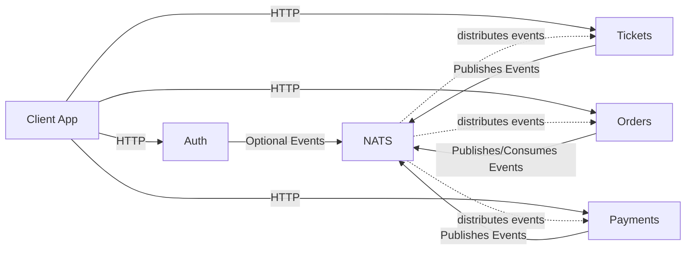

# 🎟️ Tickets — Microservices Example

A clean, beginner-friendly **Node.js + TypeScript microservices** example featuring:

* **Auth**
* **Tickets**
* **Orders**
* **Payments**
* **Client (frontend)**
* **NATS Streaming** for event-based communication
* **Kubernetes + Skaffold** for local development

This README keeps everything simple: how the system works, how to run it locally, how to run tests, and how to use Docker/K8s.

---

## 🧩 System Overview

A quick visual diagram so contributors instantly understand the flow:



Each service has its own DB, runs independently, and communicates via NATS events.

---

## 📁 What’s Included

```
auth/       → authentication service
tickets/    → ticket creation & management
orders/     → order placement, reservation, expiration
payments/   → simple payment mock service
client/     → frontend (React/Next/Vite etc.)
nats/       → publisher/subscriber examples
common/     → shared types & helpers
infra/k8s/  → Kubernetes manifests
diagrams/   → Mermaid diagrams
```

All services use their own `package.json`, `tsconfig.json`, and (when needed) `Dockerfile`.

---

## 🛠️ Prerequisites

You only need:

* Node.js **18+**
* npm / pnpm
* Docker (optional but recommended)
* kubectl + Skaffold (for K8s workflow)

---

# 🚀 Quick Start — Local Development

### 1️⃣ Start infrastructure (MongoDB + NATS)

```powershell
docker run --rm -p 4222:4222 -p 8222:8222 nats:2.10.0
docker run --rm -p 27017:27017 mongo:latest
```

### 2️⃣ Start any service (example: Auth)

```powershell
cd auth
npm install
npm run dev
```

Repeat the same for:

```
tickets/
orders/
payments/
client/
```

Client usually launches on port **3000**.

---

# 🐳 Docker — Running a Single Service

Example: run the **Auth** service in Docker.

```powershell
cd auth
docker build -t tickets-auth:local .
docker run --rm -p 3000:3000 tickets-auth:local
```

You can create a `docker-compose.yml` later to run multiple services together — just tell me and I’ll generate it.

---

# ☸️ Kubernetes + Skaffold (for local microservices dev)

To use the full multi-service setup:

```powershell
skaffold dev
```

Skaffold will:

* build all images
* apply Kubernetes manifests from `infra/k8s/`
* auto-rebuild when you change code

To only build:

```powershell
skaffold build
```

---

# 🔐 Environment Variables

Each service needs its own `.env`.

### Example for `auth/.env`

```
PORT=3000
JWT_KEY=super-secret
MONGO_URI=mongodb://localhost:27017/authdb
NATS_URL=nats://localhost:4222
NATS_CLUSTER_ID=test-cluster
NATS_CLIENT_ID=auth-service
```

### Example for `client/.env`

```
VITE_API_URL=http://localhost:3000
```

👉 Add `.env.example` files without secrets so contributors know required keys.

---

# 🧪 Running Tests

Example (run inside any service folder):

```powershell
npm install
npm test
```

The **tickets** service uses `mongodb-memory-server` and Jest for isolated in-memory tests.

---

# 📦 Project Structure (Simple View)

```
.
├── auth/
├── tickets/
├── orders/
├── payments/
├── client/
├── nats/
├── common/
├── infra/
└── diagrams/
```

---

# 🤝 Contributing

1. Create a branch
   `git checkout -b feat/your-feature`

2. Run & test the specific service you modify

3. Add tests + update `.env.example`

4. Open a PR with a clean description

---

# 📄 License

MIT License 

---


